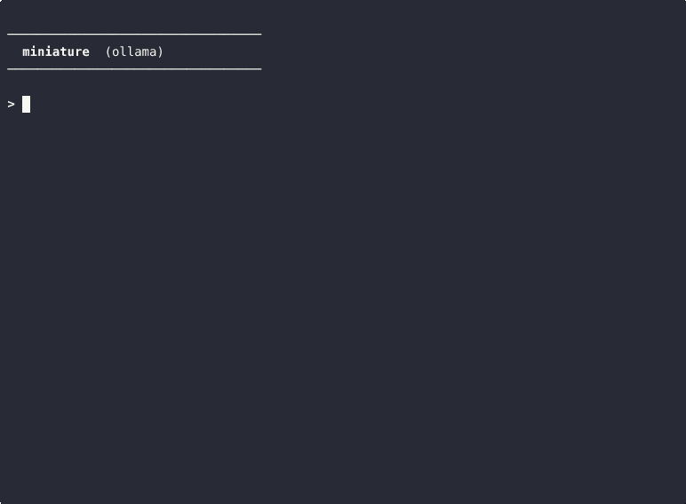

# 🔬 miniature

⚠️ This code executes arbitrary shell commands as directed by the LLM. Run it only in sandboxed or disposable environments.

A complete AI agent in ~225 lines of Python. No frameworks, no abstractions.



```
runtime.py   agent loop, tools, memory, system prompt
model.py     raw transformer inference + sampling
cli.py       terminal interface
```

## Quick start

```bash
# with ollama
ollama pull mistral-small3.2
pip install requests
python runtime.py

# with raw local inference (needs GPU)
pip install torch transformers accelerate
python runtime.py --raw-model

# inspect the raw prompt sent to the LLM
python runtime.py --raw-prompt
```

## Adding tools

```python
def calculator(expression):
    return str(eval(expression))

TOOLS["calculator"] = {"fn": calculator, "desc": "calculator(expression)"}
```

## License

MIT
